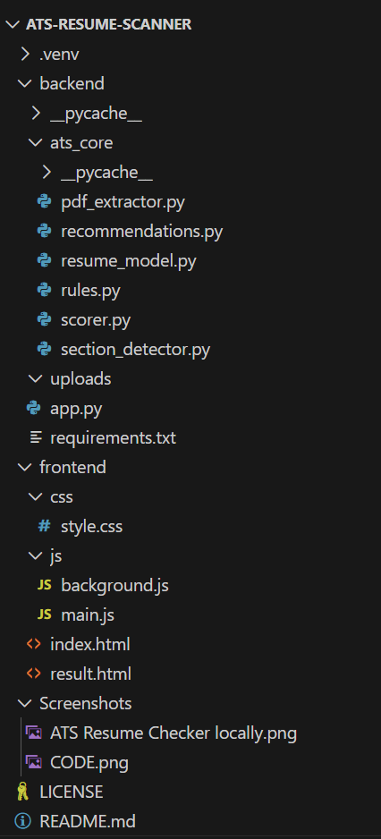
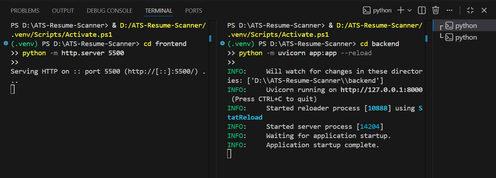

# ATS Resume Checker

A practical ATS (Applicant Tracking System) resume analyzer that evaluates how resumes are parsed, scored, and rejected by real-world ATS systems.

This project focuses on **structural correctness**, **parsing reliability**, and **common ATS failure modes** rather than resume templates or keyword stuffing.

---

##  What This Tool Does

-  Analyzes PDF resumes only
-  Generates an overall ATS compatibility score
-  Breaks scoring into clear categories:
   - **Tailoring** - Job relevance and customization
   - **Content** - Quality and structure of resume content
   - **Sections** - Presence and organization of key sections
   - **ATS Essentials** - Technical compatibility and parseability
-  Identifies concrete reasons why an ATS may reject a resume
-  Provides specific, actionable fixes for each detected issue
-  Produces consistent results across both terminal and web interfaces

---

##  How It Works

1. **PDF Parsing** - The resume PDF is parsed on the backend using rule-based analysis
2. **Structure Evaluation** - Resume structure, section layout, headers, and parsing signals are evaluated
3. **Scoring** - Scores are calculated per category using ATS-safe heuristics
4. **JSON Output** - Results are returned as structured JSON data
5. **Frontend Rendering** - The frontend renders the output exactly as produced by the backend
6. **No Persistence** - No resume data is stored or persisted

---

##  Why This Project

Most ATS checkers focus on selling templates or inflating scores through keyword matching.

This tool is designed to surface **real parsing and structural issues** that cause ATS rejection, independent of resume design, formatting styles, or templates.

**Key Differentiators:**
- No template sales or upsells
- No keyword stuffing recommendations
- Focus on actual ATS parsing issues
- Honest, actionable feedback
- Privacy-first (no data storage)

---

##  Technology Stack

### Backend
- **Python** - Core language
- **FastAPI** - REST API framework
- **PyPDF2** - PDF text extraction
- **Custom ATS Engine** - Rule-based scoring and analysis

### Frontend
- **HTML/CSS/JavaScript** - Pure vanilla implementation
- **No frameworks** - Lightweight and fast
- **Local storage** - Temporary result persistence

---

##  Running Locally

### Prerequisites
- Python 3.13+
- pip (Python package manager)
- Modern web browser

### Backend Setup

```bash
# Navigate to backend directory
cd backend

# Install dependencies
pip install -r requirements.txt

# Run the FastAPI server
uvicorn app:app --reload

The backend will be available at http://127.0.0.1:8000
```

### Frontend Setup

```bash
# Navigate to frontend directory
cd frontend

# Or use a simple HTTP server:
python -m http.server 5500

The frontend will be available at http://127.0.0.1:5500/index.html
```
---
##  Data Handling & Privacy

- 1. **No resume data is stored** - All processing is done in-memory
- 2. **No third-party APIs** - Self-contained analysis
- 3. **Per-request processing** - Each analysis is independent
- 4. **No tracking** - No analytics or user tracking
- 5. **CORS enabled** - Secure cross-origin requests
- 6. **Client-side storage** - Results only stored temporarily in browser

---
## Project Structure


## Code Page


---

##  Scoring Categories

### 1. Tailoring (45 points)
- Job description keywords
- Role-specific terminology
- Industry alignment

### 2. Content (30 points)
- Quantifiable achievements
- Action verbs
- Clear formatting
- Professional language

### 3. Sections (25 points)
- Contact information
- Work experience
- Education
- Skills
- Optional: Projects, Certifications, etc.

### 4. ATS Essentials (45 points)
- Text extractability
- No images/graphics in critical sections
- Standard fonts
- Proper date formatting
- No headers/footers/tables
- File format compatibility

**Total Score:** 100 points
---

## License

This project is licensed under the MIT License.

You are free to:
- Use the code for personal or commercial projects
- Modify and distribute the code
- Include it in your own applications

See the LICENSE file in the repository for full details.
